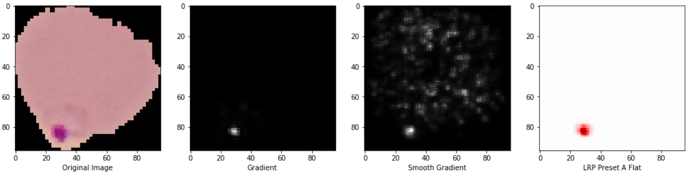
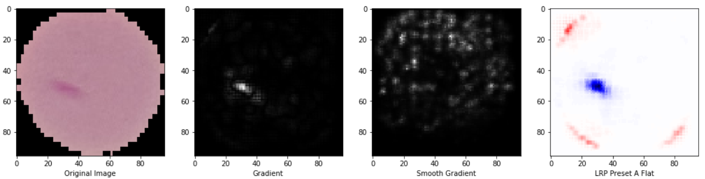
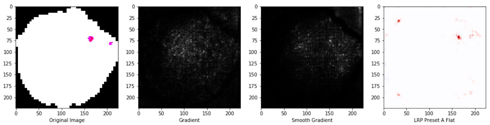
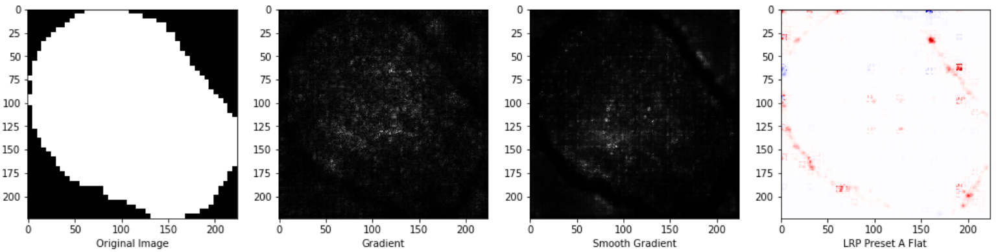
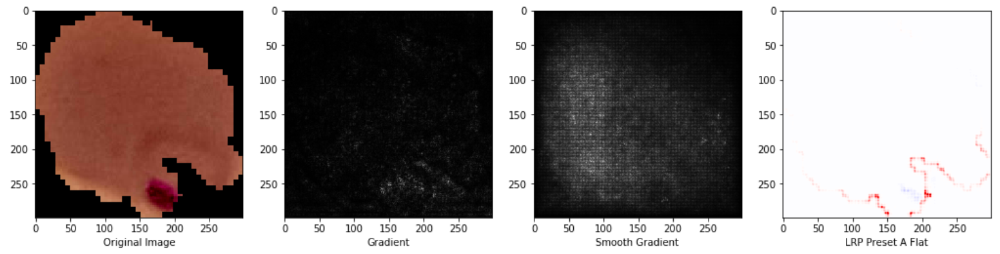
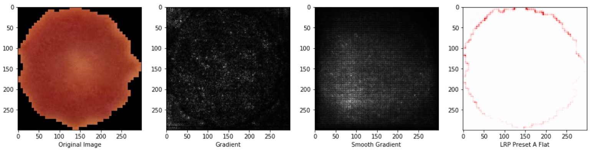
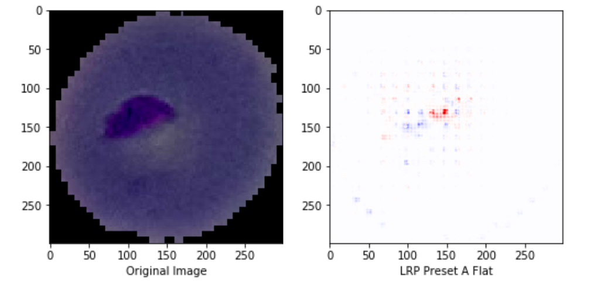
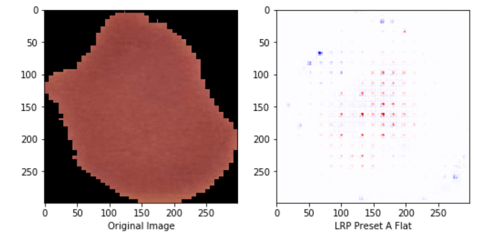

# Introduction

In this modern society, explanability of well built AI models is an issue, owing to the 'black box' mechanics behind these well-performing models. One question that might be asked : `'If the model is good, are we sure that it is learning the right thing and using the right information for prediction?'`. For this project, the aim is to first build a few models that can predict whether a cell is 'Parasitized' or 'Unparasitized' by the Malaria disease with a high accuracy. Following which, we will look into what these 'good' models are learning, given an input image, such as which parts in the cell image contribute the most to a particular prediction.

## Structure

| Folder         | Description                                                                                                     |
| :---          | :---                                                                                                            |
|data        | Contains the train, test and validation set. Refer to `malaria_baseline_data_inspection_creation.ipynb` for the creation of dataset.                               |
|notebooks       | Contains the google colab notebooks on training and analysis     |
|src    | Contains the python scripts required for the training and analysis          |
|weights     | Some sample weights stored in h5 format                      |

##  Evaluation Metrics

Here, the metrics used is accuracy, which refers to the proportion of correct predictions compared to the true classes (Parasitized/ Uninfected) by the model. In the training, the loss function used is the categorical crossentropy loss.

## Models used

The table below shows the models used for analysis. Firstly, a baseline model is built as a default reference. Secondly, transfer learning on the various pretrained Keras models was done using the Malaria dataset. All of the models were trained/ fine-tuned for 10 epochs. For all of the models that were used for transfer learning, most of the layers were frozen, with the exception of the last few layers and the additional layers. The dataset is augmented with a series of zooming, shearing and horizontal rotation before training.

| Model        | Description      | Accuracy                                                                                                   |
| :---          | :---            | :---                                                                                                 |
|Baseline        | Built using just a few convolutional layers | 95.5%                               |
|Finetuned ResNet50       | Added a few layers from the pretrained Keras ResNet50 (Transfer Learning)  | 94.9%
|Finetuned InceptionV3    | Added a few layers from the pretrained Keras InceptionV3 (Transfer Learning)      | 94.5%
|Finetuned XceptionV1     | Added a few layers from the pretrained Keras XceptionV1 | 95.8%                      

## Analysis

After training/ finetuning the models, I proceeded to analyse what each model is learning. I used the `innvestigate` module. Refer [here](https://github.com/albermax/innvestigate) for more information on how `innvestigate` is used. 3 explanation methods were used: `gradient`, `smooth gradient` and `LRP Preset A Flat`. Samples of some output images are provided below.

The image on the leftmost side depicts the original image. The images towards the right shows the parts in the original image that the model is 'seeing' when it predicts that particular class. This is illustrated by the bright spots in the gradient and smooth gradient heatmap and the red/blue spots in the LRP Preset A Flat heatmap. For the LRP Preset A Flat heatmap, red spots indicate the pixels from the original image that strongly favour the prediction that has the highest pre-softmax confidence. On the other hand, blue spots represent the pixels from the original image that are against that particular prediction.

## Findings

It seems that the 4 different models use different types of information from an image in the prediction of 'Parasitized' or 'Uninfected'. 

| Model        | Emphasis     | Parasitized   | Unparasitized                                                                                               |
| :---          | :---            | :---        | :---                                                                                            |
|Baseline        | Model focuses entirely on the purple blobs in the prediction of parasitized and at the boundaries otherwise  |      |                           |
|Finetuned ResNet50       | Model has a smaller area of focus (dots) within the parasitized regions in the preprocessed image for the parasitized class. Similar to baseline model, it also emphasizes on the boundary in the prediction of uninfected class |  | 
|Finetuned InceptionV3    | Model focuses on the boundary near the parasitized regions to predict the parasitized class. Similar to baseline, a large part of the boundary of the cell is emphasized to predict the unparasitized class      |    | 
|Finetuned XceptionV1     | Similar to the ResNet50 model, XceptionV1 focuses on a small portion of pixels within the parasitized region to predict the parasitized class. Contrary to the other 3 models, the model 'checks' the interior region instead to predict the unparasitized class. |   |     

## Conclusion

All the models are looking at the right regions in the prediction of parasitized class, be it the entire / part of the infected area or the nearby enclosure. Also, the models emphasizes on the whole or large parts of the perimeter or the interior region in the prediction of unparasitized class, which could suggest that the models are 'checking' the cell for the absence of purple patches in the process of prediction. This seems consistent with what humans do, which is to scan through the images to decide whether the cells are parasitized or not.

The point here is that good models with accurate prediction can perceive images differently. However, caution should be exercised when deploying such models since there might be times where the model might be looking at the wrong parts to coincidentally predict the correct class. With such explanation tools, it is hoped that we can one day demystify the doubts or misconceptions about the AI models. 

